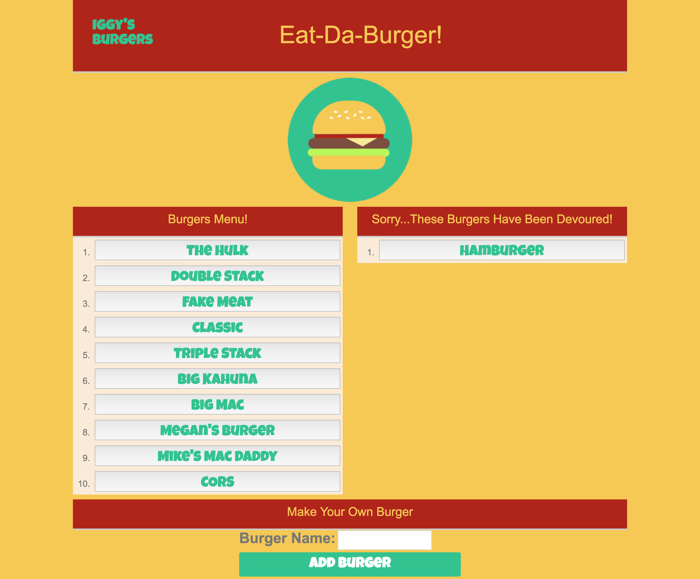

# Eat-Da-Burger!
This is a restaurant app that lets users input the names of burgers they'd like to eat.

# Node Express Handlebars

### Overview
[Find My Repository](https://github.com/iggy788/burger "Mike's Repository")

I have built an application meant to log your burgers with MySQL, Node, Express, Handlebars and a homemade ORM. The app design pattern follows a MVC structure; using Node and MySQL to query and route data in the app, and Handlebars to generate the HTML.

The app is deployed on Heroku so whoever may want to fill it out can do as well.
[Go To The Site](https://intense-reef-34889.herokuapp.com/ "FriendFind Heroku")
- - -
### Instructions

1. Whenever a user submits a burger's name, your app will display the burger on the left side of the page -- waiting to be devoured.

2. Each burger in the waiting area also has a `Devour it!` button. When the user clicks it, the burger will move to the right side of the page.

3. Your app will store every burger in a database, whether devoured or not.

- - -
### What the App Displays!

- - -
### One More Thing

**Install These Packages**
1. Go to my [GitHub](https://github.com/iggy788/burger) repo called `burger` and clone it to your computer.
2. Make a package.json file by running `npm init` from the command line.
3. Install the Express npm package: `npm install express --save`
   * [Express](https://www.npmjs.com/package/express)
4. Install the Nodemon npm package: `npm install nodemon --save`
   * [Nodemon](https://www.npmjs.com/package/nodemon)
5. Install the MySQL npm package: `npm install mysql --save`
   * [MySQL](https://www.npmjs.com/package/mysql)
6. Install the Body Parser npm package: `npm install body-parser --save`
   * [Body Parser](https://www.npmjs.com/package/body-parser)
7. Install the Handlebars npm package: `npm install express-handlebars --save`
   * [Handlebars](https://www.npmjs.com/package/express-handlebars)
- - -
#### Directory structure

All the recommended files and directories from the steps above should look like the following structure:

```
├── config
│   ├── connection.js
│   └── orm.js
│ 
├── controllers
│   └── burgers_controller.js
│
├── db
│   ├── schema.sql
│   └── seeds.sql
│
├── models
│   └── burger.js
│ 
├── node_modules
│ 
├── package.json
│
├── public
│   ├── assets
│   │   ├── css
│   │   │   └── burger_style.css
│   │   └── img
│   │       └── burger.png
│   └── test.html
│
├── server.js
│
└── views
    ├── index.handlebars
    └── layouts
        └── main.handlebars
```
- - -
**Good Luck!**